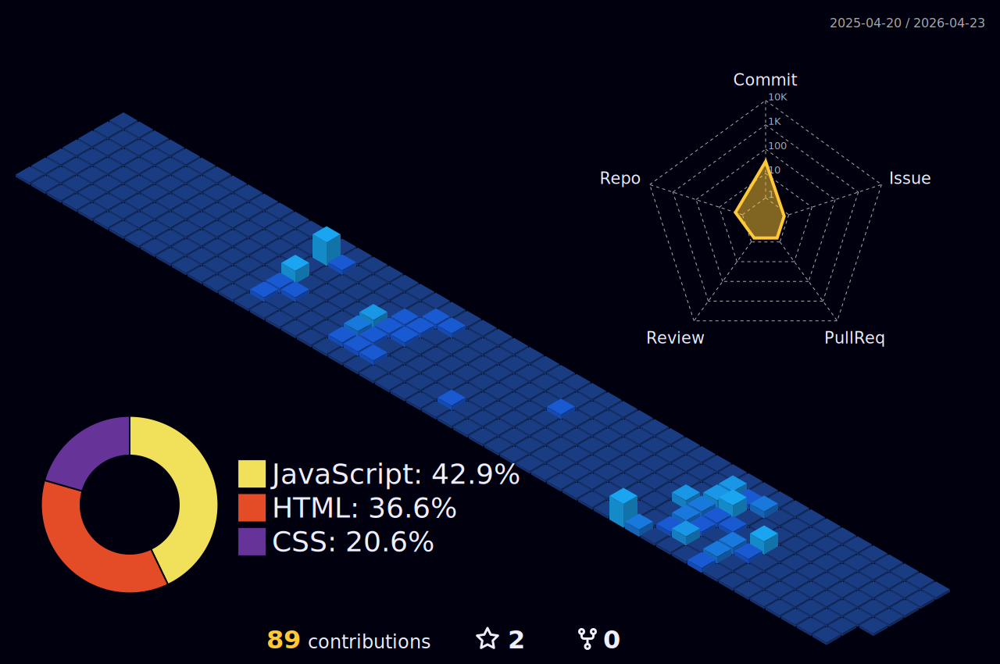

## Hi👋

🎮 Passionate about creating games and building software.  
💻 Experience with **C#, Unity, Python, and game systems programming**.  
🚀 Always learning new tech and improving my problem-solving skills.

<!-- Profile View -->

<a href="https://github.com/ashutosh00710/github-readme-activity-graph">
<picture>
  <source media="(prefers-color-scheme: dark)" srcset="https://github-readme-activity-graph.vercel.app/graph/?username=hsy0090&bg_color=00000f&color=007bff&line=fac539&point=FFFFFF&hide_border=true">
  
</picture>
</a>

<!-- github-stats -->

<a href="https://github.com/hsy0090/github-stats">
<picture>
  <source media="(prefers-color-scheme: dark)" srcset="https://raw.githubusercontent.com/hsy0090/github-stats/master/generated/overview.svg#gh-dark-mode-only">
  
</picture>
</a>

<a href="https://github.com/hsy0090/github-stats">
<picture>
  <source media="(prefers-color-scheme: dark)" srcset="https://raw.githubusercontent.com/hsy0090/github-stats/master/generated/languages.svg#gh-dark-mode-only">
  
</picture>
</a>

#### Languages

#### Markup

#### Databases

#### IDEs

#### Source Control

#### Frameworks

#### Cloud Services

#### Platforms

#### Work Experience

<!--
**hsy0090/hsy0090** is a ✨ _special_ ✨ repository because its `README.md` (this file) appears on your GitHub profile.

Here are some ideas to get you started:

- 🔭 I’m currently working on ...
- 🌱 I’m currently learning ...
- 👯 I’m looking to collaborate on ...
- 🤔 I’m looking for help with ...
- 💬 Ask me about ...
- 📫 How to reach me: ...
- 😄 Pronouns: ...
- ⚡ Fun fact: ...
-->
